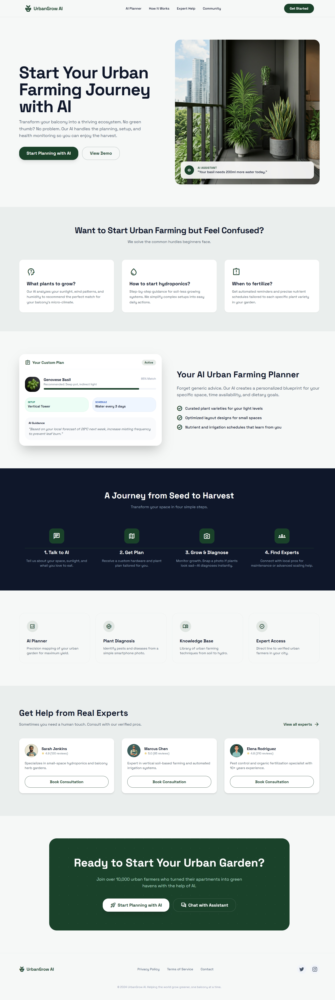
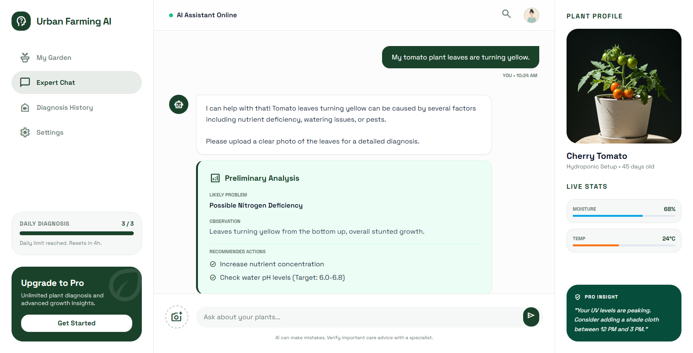
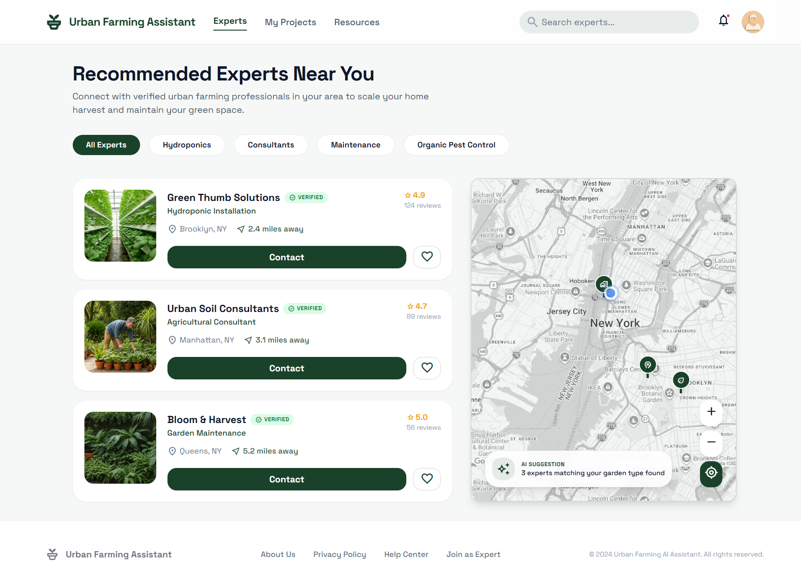
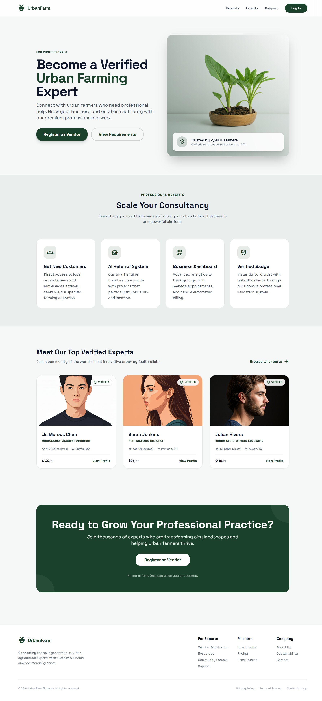
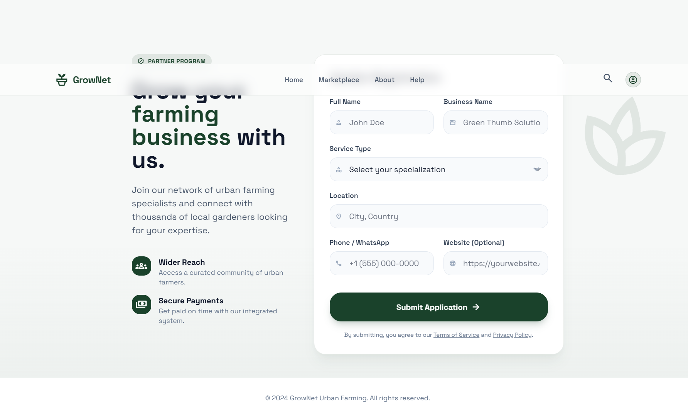
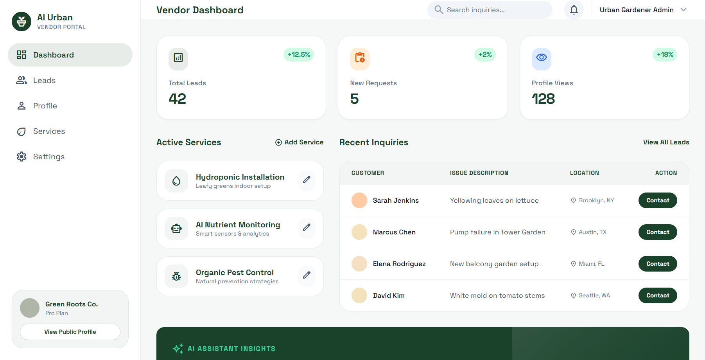

# Design Document

Dokumen ini merangkum arah desain produk AI Urban Farming Assistant berdasarkan tiga sumber utama:

- ide awal di OLD_README.md
- konsep produk terbaru di README.md
- aset UI dari folder stitch

Tujuan dokumen ini adalah menyatukan narasi bisnis dan bentuk antarmuka, sehingga proposal, prototype, dan pengembangan berikutnya bergerak di arah yang sama.

## 1. Ringkasan Konsep Produk

### Ide awal

Di OLD_README.md, produk diposisikan sebagai platform digital urban farming ecosystem yang menghubungkan:

- masyarakat kota yang ingin mulai urban farming
- vendor instalasi dan perawatan
- penyedia produk dan perlengkapan
- knowledge base pertanian
- potensi AI diagnosis, AI nutrient estimation, IoT, dan supply chain extension

Secara bisnis, ide awalnya kuat karena mengarah ke ketahanan pangan perkotaan, pemberdayaan UMKM, dan digitalisasi pertanian.

### Konsep yang sekarang

Di README.md, konsep tersebut dipersempit menjadi MVP yang lebih fokus dan realistis untuk dipresentasikan:

- AI Urban Farming Planner
- AI Chat Consultation
- Image-based Plant Diagnosis
- Expert Discovery
- Vendor Registration dan Vendor Dashboard

Artinya, prototype saat ini tidak lagi mencoba menampilkan seluruh ekosistem sekaligus, tetapi memusatkan pengalaman pada alur inti berikut:

**Start -> Plan -> Grow -> Diagnose -> Get Expert Help**

### Posisi desain Stitch terhadap project

Desain dari folder stitch sudah cukup konsisten dengan README baru. Semua layar utamanya mendukung dua sisi platform:

- sisi user: edukasi, perencanaan, diagnosis, dan pencarian expert
- sisi vendor: akuisisi, registrasi, dan pengelolaan lead

Dengan begitu, desain yang ada sekarang bisa dipahami sebagai bentuk visual dari MVP, sementara cakupan di OLD_README.md menjadi roadmap fase berikutnya.

## 2. Arah Desain Produk

Desain prototype menunjukkan beberapa prinsip yang relevan dengan karakter project:

- visual bernuansa natural dan clean, dominan hijau gelap, abu terang, dan putih
- tone modern dan accessible untuk pemula, bukan aplikasi pertanian yang terasa teknis dan berat
- banyak trust signal, seperti verified badge, rating, lead metrics, dan AI insight cards
- layout menekankan clarity, dengan card-based UI, whitespace besar, dan CTA yang sangat jelas
- desain mendukung narasi AI as companion, bukan sekadar dashboard data

Secara visual, ini cocok dengan positioning produk sebagai asisten urban farming untuk pemula perkotaan yang butuh bimbingan praktis, cepat, dan terasa aman.

## 3. Peta Experience

### User side

1. User masuk dari landing page dan memahami value proposition.
2. User tertarik mencoba AI planner atau AI assistant.
3. User berkonsultasi melalui chat untuk masalah tanaman atau setup kebun.
4. Jika masalah lebih kompleks, user diarahkan ke expert recommendation.
5. User menghubungi expert yang sesuai dengan kebutuhan dan lokasi.

### Vendor side

1. Calon vendor melihat halaman benefit untuk bergabung.
2. Vendor mengisi form registrasi.
3. Setelah diverifikasi, vendor mengakses dashboard.
4. Vendor menerima lead, mengelola layanan, dan memantau performa profil.

Ini menunjukkan bahwa desain sudah membentuk fondasi platform dua sisi, yang sangat nyambung dengan ide awal di OLD_README.md.

## 4. Screen-by-Screen Design

### 4.1 Landing Page

Source: stitch/revised_landing_page/code.html

Peran layar ini:

- menjelaskan problem utama pemula urban farming
- memperkenalkan AI sebagai pembimbing utama
- menunjukkan value chain dari planning sampai expert help
- menjadi entry point akuisisi user

Hubungan dengan project:

- bagian hero menegaskan AI-assisted urban farming journey
- section pain points menerjemahkan masalah di README: bingung mulai, setup hidroponik, jadwal nutrisi
- section planner memperlihatkan diferensiasi utama produk, yaitu personalisasi berdasarkan kondisi user
- section how it works langsung selaras dengan core journey di README
- section expert cards menjadi jembatan ke fitur expert discovery dan vendor ecosystem

Catatan desain:

- tampilan ini paling cocok untuk demo pitch karena sangat cepat menjelaskan masalah, solusi, dan flow produk
- CTA utama sudah tepat: Start Planning with AI
- visual balkon dan overlay AI insight memperkuat konteks urban farming di ruang terbatas

### 4.2 AI Consultation Chat

Source: stitch/ai_consultation_chat/code.html

Peran layar ini:

- menjadi pusat interaksi utama antara user dan AI
- menampilkan diagnosis awal, rekomendasi tindakan, dan profil tanaman
- menjadi tempat monetization melalui batas diagnosis harian dan upgrade Pro

Hubungan dengan project:

- langsung mewakili fitur AI Chat Consultation
- panel analisis mewakili Image-Based Plant Diagnosis
- plant profile dan live stats membuka ruang pengembangan ke IoT smart garden yang disebut di OLD_README.md
- card Pro Insight cocok untuk model freemium yang ada di README

Catatan desain:

- pembagian tiga kolom efektif untuk menunjukkan konteks, percakapan, dan status tanaman secara bersamaan
- warning kecil bahwa AI bisa salah adalah detail penting untuk trust dan safety
- halaman ini terasa paling dekat dengan demo functional product

### 4.3 Expert Recommendations

Source: stitch/expert_recommendations/code.html

Peran layar ini:

- membantu user menemukan bantuan profesional ketika AI saja tidak cukup
- menampilkan expert list berdasarkan kategori, lokasi, rating, dan jarak
- memperlihatkan sisi marketplace jasa tanpa harus membangun e-commerce penuh lebih dulu

Hubungan dengan project:

- sangat selaras dengan fitur Expert Discovery di README
- menjadi turunan langsung dari ide awal tentang jasa instalasi dan perawatan kebun
- map panel mempertegas aspek local service discovery, yang relevan untuk urban farming berbasis komunitas kota

Catatan desain:

- format list plus map memudahkan user memilih expert secara cepat
- verified badge penting untuk trust building
- ini bisa jadi transisi yang sangat kuat dari hasil diagnosis AI ke konversi layanan berbayar

### 4.4 Become a Vendor

Source: stitch/become_a_vendor/code.html

Peran layar ini:

- menjadi landing page akuisisi supply side
- menjelaskan manfaat gabung bagi professional atau UMKM urban farming
- menegaskan bahwa platform tidak hanya untuk user akhir, tetapi juga untuk expert network

Hubungan dengan project:

- mengeksekusi bagian Vendor Ecosystem di README
- menghubungkan ide awal tentang vendor instalasi, perawatan, dan konsultasi dengan jalur onboarding yang jelas
- memperkuat narasi bahwa platform membuka peluang ekonomi bagi penyedia jasa urban farming

Catatan desain:

- positioning professional benefits sangat cocok untuk pitch ke stakeholder atau juri karena menunjukkan model bisnis dua sisi
- adanya contoh expert card dan CTA register memperjelas supply acquisition funnel

### 4.5 Vendor Registration

Source: stitch/vendor_registration/code.html

Peran layar ini:

- mengubah minat vendor menjadi aplikasi pendaftaran yang konkret
- mengumpulkan data minimum yang dibutuhkan untuk verifikasi dan matching layanan

Hubungan dengan project:

- sesuai dengan bagian Vendor Registration di README
- field service type, location, phone, dan website sudah cukup untuk MVP matching engine
- dapat dikembangkan lebih lanjut untuk verifikasi sertifikasi, area coverage, portofolio, dan jam layanan

Catatan desain:

- form ini sederhana dan efisien, cocok untuk onboarding cepat
- sisi kiri menjelaskan value proposition sehingga form tidak terasa dingin atau administratif

### 4.6 Vendor Dashboard

Source: stitch/vendor_dashboard/code.html

Peran layar ini:

- menjadi pusat operasi vendor setelah onboarding
- menampilkan lead masuk, layanan aktif, dan insight bisnis
- menegaskan bahwa platform tidak berhenti di akuisisi, tapi juga membantu monetisasi vendor

Hubungan dengan project:

- langsung mewakili fitur Vendor Dashboard di README
- card analytics menunjukkan dasar business intelligence untuk vendor
- recent inquiries menghubungkan expert dengan kebutuhan user secara nyata
- AI assistant insights bisa menjadi diferensiasi platform dibanding direktori jasa biasa

Catatan desain:

- dashboard ini membantu menjelaskan monetization dan retention dari sisi supply
- sangat cocok untuk menunjukkan bahwa platform bisa berkembang menjadi SaaS ringan untuk mitra urban farming

## 5. Hubungan Desain dengan Nilai Proposal

Kalau dikaitkan ke framing proposal PIDI, desain yang ada sudah mendukung beberapa pesan besar:

- **ketahanan pangan perkotaan**: user dibantu mulai menanam di ruang terbatas
- **digitalisasi pertanian**: AI menjadi lapisan bantuan utama dalam planning dan diagnosis
- **pemberdayaan masyarakat dan UMKM**: expert dan vendor lokal masuk sebagai bagian inti ekosistem
- **smart agriculture**: live stats, AI insight, dan diagnosis berbasis gambar membuka pintu ke integrasi sensor dan automasi

Dengan kata lain, desain ini tidak hanya bagus secara UI, tetapi juga sudah mendukung narasi kebijakan dan dampak sosial yang dibutuhkan untuk proposal kompetisi.

## 6. Fitur yang Sudah Tercermin dan yang Masih Belum

### Sudah tercermin di desain

- landing dan onboarding user
- AI planner
- AI consultation
- diagnosis awal tanaman
- expert recommendation
- vendor acquisition
- vendor registration
- vendor dashboard
- monetization freemium ringan

### Belum divisualisasikan secara khusus

- marketplace produk urban farming
- knowledge base atau forum komunitas yang lebih lengkap
- halaman project tracking untuk user garden lifecycle
- IoT monitoring detail dengan histori sensor
- marketplace hasil panen atau supply chain extension

Ini penting dicatat supaya Design.md juga berfungsi sebagai batas yang jelas antara **scope MVP saat ini** dan **roadmap pengembangan berikutnya**.

## 7. Kesimpulan

Desain dari folder stitch sudah sangat cocok untuk merepresentasikan versi MVP dari AI Urban Farming Assistant. Dibanding ide awal yang sangat luas di OLD_README.md, desain sekarang mengambil fokus yang lebih tajam: membantu user mulai urban farming, memberi diagnosis dan arahan berbasis AI, lalu menghubungkan mereka dengan expert lokal.

Di saat yang sama, desain vendor pages memastikan platform tetap punya fondasi bisnis dua sisi. Ini penting karena membuktikan bahwa project bukan hanya chatbot pertanian, tetapi calon ekosistem layanan urban farming yang bisa berkembang ke marketplace, monitoring, dan smart agriculture platform yang lebih besar.

## 8. Lampiran Aset

- Landing page: docs/design-images/landing-page.png
- AI consultation chat: docs/design-images/ai-chat.png
- Expert recommendations: docs/design-images/expert-recommendations.png
- Become a vendor: docs/design-images/become-a-vendor.png
- Vendor registration: docs/design-images/vendor-registration.png
- Vendor dashboard: docs/design-images/vendor-dashboard.png
